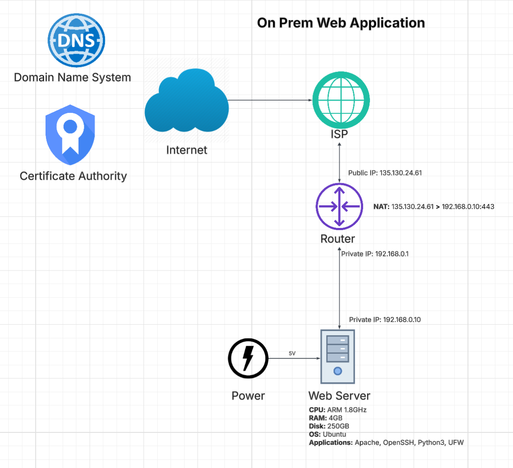
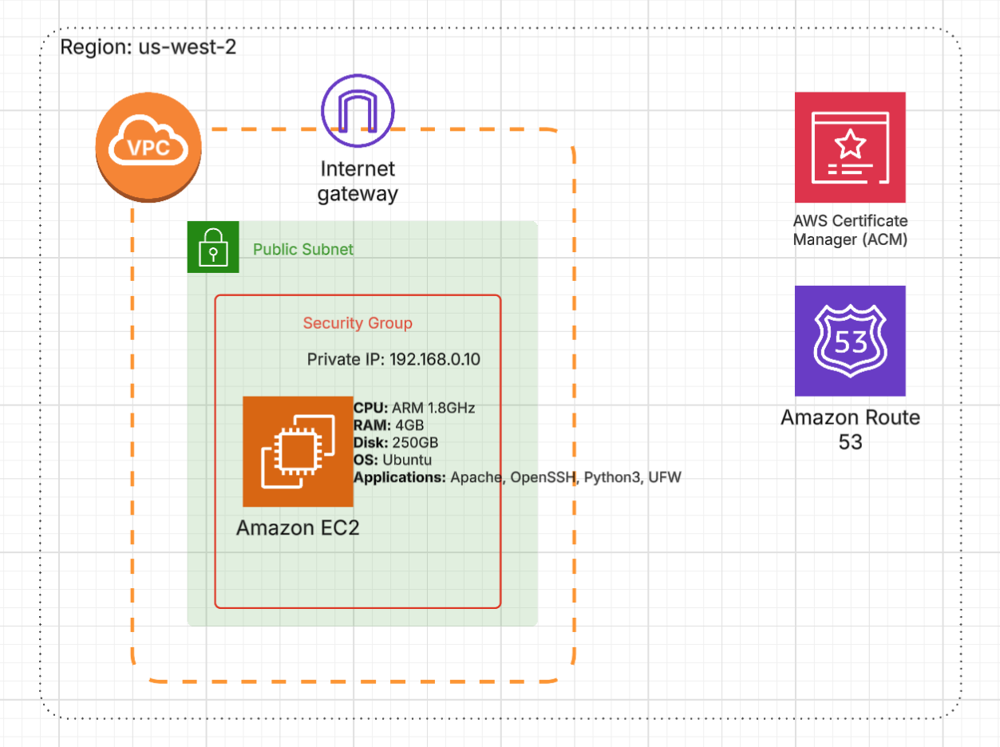
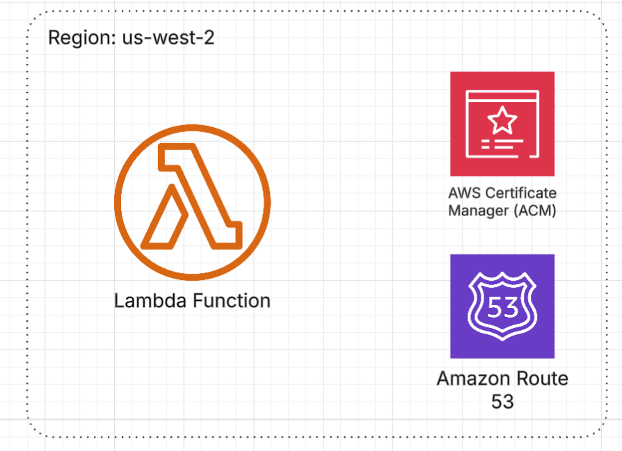

# Intro to AWS and Infrastructure as Code with Terraform

## Table of Contents
- [Overview](#overview)
  - [Benefits of Infrastructure as Code](#benefits-of-infrastructure-as-code)
- [History of Web Applications](#history-of-web-applications)
  - [Traditional On-Prem Web App](#traditional-on-prem-web-app)
  - [Cloud Virtual Machines](#cloud-virtual-machines)
  - [Serverless Computing](#serverless-computing)
- [Getting Started](#getting-started)
  - [Prerequisites](#prerequisites)
  - [Confirm Configuration](#confirm-configuration)
  - [Create Resources](#create-resources)
  - [Testing](#testing)
  - [Destroy Resources](#destroy-resources)
- [Whats Next](#whats-next)

## Overview

In this lab, you'll get hands-on experience with modern cloud infrastructure by deploying a small Python Flask web application using Amazon Web Services (AWS) and Terraform, a powerful Infrastructure as Code (IaC) tool.

In enterprise environments, engineers rarely configure cloud resources manually through web consoles. Instead, they use Infrastructure as Code (IaC) tools like Terraform to define, deploy, and manage infrastructure consistently, repeatably, and automatically.

### Benefits of Infrastructure as Code:
- **Consistency:** Ensures identical environments every time.
- **Reduced Errors:** Eliminates manual configuration mistakes.
- **Automation:** Manages infrastructure efficiently like software.
- **Versioning & Auditing:** Makes tracking and reverting changes easy.

By completing this lab, you'll learn to:
- Deploy a serverless web application using AWS.
- Write Terraform code to automate cloud resource provisioning.
- Understand core cloud computing concepts (compute, storage, scalability).
- Appreciate how IaC streamlines deployment and infrastructure management.
- Recognize differences between cloud-based and traditional deployments.

This practical introduction to cloud computing and DevOps principles will equip you with critical skills for modern software engineering.

## History of Web Applications

Web applications run in browsers, enabling users to interact dynamically over the internet. Originally, websites were static, providing only basic information. Modern web apps, however, offer dynamic, interactive experiences, such as online shopping, real-time messaging, social media, and collaborative tools like Google Docs.

Web hosting has evolved significantly:

- **On-Prem Servers:** Businesses owned and managed physical servers.
- **Cloud Virtual Machines (VMs):** Companies migrated infrastructure to cloud providers like AWS, reducing physical hardware needs but still requiring manual maintenance.
- **Serverless:** Developers focus solely on code, while AWS handles server management, scaling, and infrastructure.

## Traditional On-Prem Web App



A typical on-prem web application setup includes:

### Core Components:
- **Utilities:** Reliable power and internet connectivity
- **Hardware:** Servers (CPU, RAM, storage), routers, modems
- **Networking:** IP addressing, routing, NAT configurations
- **Software:** OS (e.g., Ubuntu), web servers (Apache/Nginx), firewalls, application dependencies

### Challenges:
- **High Infrastructure Overhead:** Extensive manual setup and maintenance.
- **Scalability Issues:** Expensive and slow hardware upgrades.
- **High Personnel Costs:** Requires system administrators and network engineers.

These complexities led businesses to adopt cloud solutions.

## Cloud Virtual Machines



Cloud VMs improve availability and reliability while eliminating hardware management.

### Shared Responsibility Model

AWS handles hardware, security, and data-center management. However, users must still:
- Configure Virtual Private Clouds (VPC), subnets, security groups, internet gateways.
- Deploy and manage EC2 instances (virtual servers).
- Install and configure software (OS, web server, dependencies).

### Limitations:
- **Single Server Setup:** Limited scalability and redundancy.
- **Manual Scaling:** Requires proactive capacity planning.
- **Security Concerns:** Ongoing OS patching and server security management.

### Enhancements:

Businesses overcome these limitations using:
- **Auto Scaling Groups (ASGs):** Automatically scale server instances based on demand.
- **Elastic Load Balancers (ELBs):** Distribute traffic for better performance and availability.
- **Multi-region Deployments:** Ensure disaster recovery and low latency.

## Serverless Computing



Serverless computing fully removes server management. AWS automatically handles infrastructure and scaling, allowing developers to focus on their code.

### Benefits of Serverless:
- **Cost Efficiency:** Pay only when functions run.
- **Automatic Scaling:** AWS manages scaling seamlessly.
- **Reduced Operational Overhead:** No OS maintenance or security patches.
- **Enhanced Security:** Smaller attack surface due to lack of persistent servers.

### AWS Lambda

In this lab, you'll specifically explore AWS Lambda, AWS's primary serverless compute service.

## Getting Started

### Prerequisites

Before starting, ensure you have:
- **Laptop:** Windows, Mac, or Linux
- **IDE:** [VS Code](https://code.visualstudio.com/) (recommended) with [Terraform extension](https://marketplace.visualstudio.com/items?itemName=HashiCorp.terraform) installed
- **Terminal:**
  - macOS: [iTerm2](https://iterm2.com/)
  - Windows: [Git Bash](https://git-scm.com/downloads)
- **Terraform:** Version 1.11.2
  - Verify installation by running: `terraform --version`
- **AWS CLI (Optional):** Version 2.x.x
  - Verify installation by running: `aws --version`
- **Lab Files:**
  - Clone this repo locally `git clone https://github.com/xjoin-ai/labs.git`
- **AWS Credentials:**
  - You will need and IAM role or user with the following permissions:
  ```
        "lambda:CreateFunction",
        "lambda:UpdateFunctionCode",
        "lambda:UpdateFunctionConfiguration",
        "lambda:CreateFunctionUrlConfig",
        "lambda:GetFunction",
        "lambda:GetFunctionConfiguration",
        "lambda:DeleteFunction"
        "iam:CreateRole",
        "iam:GetRole",
        "iam:PutRolePolicy"
  ```

### Confirm Configuration

1. **Navigate to the Terraform Directory:**
   In your terminal, change to the `terraform` folder:

       cd labs/terraform

2. **Verify Installations:**

       terraform --version
       aws --version

3. **Set Up AWS Credentials:**
   Export your AWS credentials as environment variables:

       export AWS_ACCESS_KEY_ID="YOUR_ACCESS_KEY"
       export AWS_SECRET_ACCESS_KEY="YOUR_SECRET_KEY"
       export AWS_REGION="us-west-2"

   *Tip:* Consider using a credentials file or a secrets manager for production environments.

4. **Initialize and Plan Terraform:**
   Run the following commands to initialize and preview the changes:

       terraform init
       terraform plan

### Create Resources

Once you are satisfied with the plan, create the resources in your AWS account:

    terraform apply

Follow the prompt to confirm the action.

### Testing

After a successful deployment, Terraform will output a Lambda Function URL. Open this URL in your browser or use `curl` to verify that your web application is running.

### Destroy Resources

When you are finished with the lab, clean up your resources to avoid unnecessary costs:

    terraform destroy

## Troubleshooting & FAQs

**Common Issues:**
- **Authentication Errors:** Ensure your AWS credentials are correctly set and have the required permissions.
- **Terraform Errors:** Verify you are in the correct directory and your Terraform version matches the requirements.
- **Resource Not Found:** Double-check that your AWS region is correctly specified.

**FAQs:**
- **Q:** What if the Lambda URL isn’t working?
  **A:** Check the AWS Lambda console for errors and review CloudWatch logs.
- **Q:** How can I customize the web app?
  **A:** Modify the Flask application code in the repository and update the Terraform configuration accordingly.

## What's Next

After completing this lab, consider exploring:
- **Advanced Terraform Modules:** Learn how to modularize and reuse your Terraform code.
- **CI/CD Integration:** Automate deployments using AWS CodePipeline or GitHub Actions.
- **Monitoring & Logging:** Dive deeper into AWS CloudWatch for monitoring and troubleshooting.
- **Other AWS Services:** Experiment with additional services like AWS API Gateway, DynamoDB, or S3 for a more comprehensive web app.

## Additional Resources

- [Terraform Documentation](https://www.terraform.io/docs)
- [AWS Lambda Documentation](https://docs.aws.amazon.com/lambda/)
- [AWS IAM Best Practices](https://docs.aws.amazon.com/IAM/latest/UserGuide/best-practices.html)
- [Flask Documentation](https://flask.palletsprojects.com/)
